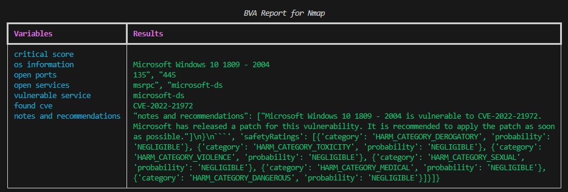
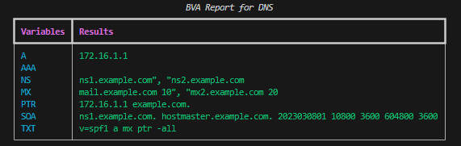
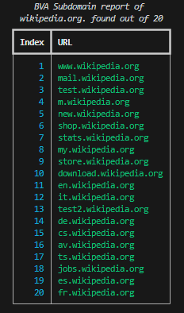
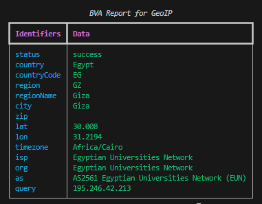

## Introduction

The Bard Vulnerability Assessment application serves as a proof-of-concept (PoC) tool, showcasing the practical application of AI (LLMs) in producing precise vulnerability analysis results. This application seamlessly incorporates multiple modules, such as the Bard API, Python-Nmap, and DNSResolver, to conduct comprehensive network vulnerability assessments, DNS enumeration, and other related tasks.

## Features

- Integration with Google Bard AI for enhanced vulnerability analysis.
- Network vulnerability scanning using Python-Nmap.
- DNS enumeration to identify subdomains.
- Interactive terminal menu for ease of use.
- Detailed reporting with AI-generated insights.
- Support for different scan profiles.

## Requirements

- Python
- All the packages mentioned in the requirements.txt file
- Bard API (MakerSuite Palm)
- IPGeolocation API

### Import packages

```bash
cd package && pip install .
```

## Usage CLI

- First Change the "BARD_API_KEY" "GEOIP_API_KEY" and part of the code with Bard api key and the IPGeolocation API key in the `.env` file

```bash
GEOIP_API_KEY = ''
BARD_API_KEY = ''
```

- second install the packages

pip install -r requirements.txt

- run the code python bard_VA.py

```bash
# Specify target with the attack
python bard_VA.py --target "IP" --attack dns/nmap

# Specify target and profile for nmap
python bard_VA.py --target "IP" --attack nmap --profile "1-5"

# Specify target for DNS no profile needed
python bard_VA.py --target "IP or host" --attack dns

# Specify target for Subdomain Enumeration no profile used default list file
python bard_VA.py --target "host" --attack sub

# Specify target for Subdomain Enumeration no profile used custom list file
python bard_VA.py --target "host" --attack sub --list "PATH to FILE"

# Specify target for geolocation lookup
python bard_VA.py --target "IP" --attack geo
```
- Interactive step by step cli interface

#### CLI Interface Option
```bash
python bard_VA.py --menu True
┏━━━━━━━━━┳━━━━━━━━━━━━━━━━┓
┃ Options ┃ Utility        ┃
┡━━━━━━━━━╇━━━━━━━━━━━━━━━━┩
│ 1       │ Nmap Enum      │
│ 2       │ DNS Enum       │
│ 3       │ Subdomain Enum │
│ 4       │ GEO-IP Enum    │
│ q       │ Quit           │
└─────────┴────────────────┘
Enter your choice:
```
## Understanding the code

Profiles:

| Parameter | Return data | Description           | Nmap Command                                          |
| :-------- | :---------- | :-------------------- | :---------------------------------------------------- |
| `p1`      | `json`      | Effective Scan        | `-Pn -sV -T4 -O -F`                                   |
| `p2`      | `json`      | Simple Scan           | `-Pn -T4 -A -v`                                       |
| `p3`      | `json`      | Low Power Scan        | `-Pn -sS -sU -T4 -A -v`                               |
| `p4`      | `json`      | Partial Intense Scan  | `-Pn -p- -T4 -A -v`                                   |
| `p5`      | `json`      | Complete Intense Scan | `-Pn -sS -sU -T4 -A -PE -PP  -PY -g 53 --script=vuln` |

The nmap subprocess will carry out the scan specified by the profile. argparse will be used to supply the Ip or target. The custom nmap scan is launched first, and it contains all the necessary arguments for the scan to proceed. The scan data is then retrieved from the enormous data collection driven by nmap. Each sub-data under "tcp" in the "scan" object is labeled with the ports that are open. Once the data has been extracted, a prompt is used to send the data to the openAI API Davinci model. The prompt clearly requests a JSON output and specifies how the data should be used.

## Using Bard AI

Before you begin the journey, make sure to obtain an API key. Begin by visiting makersuite.google.com, where you can sign up using your Google account. Please note that access to the API may require you to join a waiting list. After signing up and potentially joining the waiting list, locate the ”Get an API key” option and click on it. Once you’ve acquired the API key, you’re all set to dive into using the API. Google offers a selection of libraries for PaLM 2. At present, access is available through Python and Node libraries, along with CURL requests.

### Output

- Nmap scan output:



- DNS scan output:



- Subdomain Enumeration:



- GEO Location output:




## Advantage

- Facilitates Advanced System Development: The integration of Bard API and the vulnerability scanner paves the way for the development of sophisticated systems entirely reliant on this powerful combination. It serves as a foundational component for building cutting-edge security solutions.

- Enhances DNS Data Analysis: This integration significantly improves the analysis of DNS information, enabling the resolution of multiple records in a more refined and structured format. This enhanced capability provides a clearer and more comprehensive view of DNS data, aiding in the identification of potential vulnerabilities.

- Amplifies System Effectiveness: By harnessing the synergy between the Bard API and the scanner, the project amplifies the overall effectiveness of the final system. This synergy not only boosts the accuracy of vulnerability assessments but also streamlines the workflow, ultimately resulting in a more potent and efficient security solution.